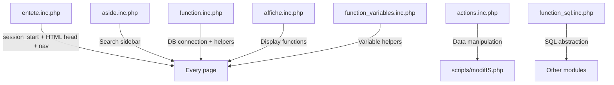

# 🔍 ISadmin — PHP 8.5 Compatibility Audit

> **Date**: 2026-05-06  
> **Scope**: `isadmin-copy/isadmin/` directory  
> **Goal**: Identify real PHP 8.5 compatibility risks without modifying code  

---

## 1. 🏗️ Application Architecture

### Entry Points
```
Root index.php → 301 redirect to intranet homepage
isadmin/index.php → Main dashboard (welcome page)
isadmin/liste.php → List IS elements from selected databases
isadmin/liste_request_names.php → List name attribution requests
isadmin/ficheIS.php → Full IS element detail/edit form (565 lines!)
isadmin/ficheAttrib.php → Name attribution form
isadmin/ficheSubmiter.php → Submitter detail/edit form
isadmin/blast.php → BLAST search interface
```

### Include/Dependency Tree


### Session Flow
```
entete.inc.php → session_start()
    → Reads/writes $_SESSION['base'] (selected databases: IS, ISSub, ISWait, ISTrash)
    → Checkbox form auto-submits to reload page with new base selection

aside.inc.php → Stores search parameters in $_SESSION

ficheIS.php → Heavy session usage: stores ALL form fields in $_SESSION
    → Uses val_session GET parameter to decide: read from DB or keep session values
```

### Database Connection
```php
// function.inc.php — Two connection functions:
connexion($bdd)  → connects to specific database (ISfinder or ISsubmit)
connect($user, $bdd) → more flexible version (not widely used)

// Host: astun.ibcg.biotoul.fr
// User: isadmin / Password: PtG8adm2is
// Uses: mysqli_connect() with die() on failure
```

---

## 2. 🚨 PHP 8.5 Compatibility Issues

### Priority Legend
| Level | Meaning |
|-------|---------|
| 🔴 CRITICAL | Will crash / fatal error in PHP 8.5 |
| 🟠 HIGH | Will produce warnings that break `header()` redirects |
| 🟡 MEDIUM | Deprecation warnings, potential logic bugs |
| 🟢 LOW | Best practice, cosmetic |

---

### 🔴 CRITICAL Issues

#### C1. Accessing undefined `$_GET` keys without `isset()` — FATAL in PHP 8.5
In PHP 8.0+, accessing an undefined array key throws a **Warning**. In PHP 8.5, this is even stricter.

| File | Line | Code | Fix |
|------|------|------|-----|
| [liste.php](file:///c:/Users/ianha/githubrepo/ISfinder%20-%20Stage/isadmin-copy/isadmin/liste.php#L7) | 7 | `$error = $_SESSION['error'];` | `$error = $_SESSION['error'] ?? "";` |
| [liste.php](file:///c:/Users/ianha/githubrepo/ISfinder%20-%20Stage/isadmin-copy/isadmin/liste.php#L18) | 18 | `if ($error){` | Already fixed if L7 is fixed |
| [liste.php](file:///c:/Users/ianha/githubrepo/ISfinder%20-%20Stage/isadmin-copy/isadmin/liste.php#L25) | 25 | `if ($_GET['base_submiter'] && ...` | `if (isset($_GET['base_submiter']) && ...` |
| [liste.php](file:///c:/Users/ianha/githubrepo/ISfinder%20-%20Stage/isadmin-copy/isadmin/liste.php#L45) | 45 | `echo "<h2> $base_select </h2>"` | `$base_select` undefined in submiter branch |
| [liste_request_names.php](file:///c:/Users/ianha/githubrepo/ISfinder%20-%20Stage/isadmin-copy/isadmin/liste_request_names.php#L10) | 10 | `if ($_GET['error']){` | `if (isset($_GET['error']) && $_GET['error']){` |
| [liste_request_names.php](file:///c:/Users/ianha/githubrepo/ISfinder%20-%20Stage/isadmin-copy/isadmin/liste_request_names.php#L14) | 14 | `$_GET['bdd'] == "ISfinder"` | `($_GET['bdd'] ?? '') == "ISfinder"` |
| [liste_request_names.php](file:///c:/Users/ianha/githubrepo/ISfinder%20-%20Stage/isadmin-copy/isadmin/liste_request_names.php#L15) | 15 | `$champrecherche = $_GET['champ'];` | `$_GET['champ'] ?? ""` |
| [ficheIS.php](file:///c:/Users/ianha/githubrepo/ISfinder%20-%20Stage/isadmin-copy/isadmin/ficheIS.php#L10) | 10 | `if ($_SESSION['error']){` | `if (!empty($_SESSION['error'])){` |
| [ficheIS.php](file:///c:/Users/ianha/githubrepo/ISfinder%20-%20Stage/isadmin-copy/isadmin/ficheIS.php#L14) | 14 | `$_GET['bdd']) ? ...` | `(isset($_GET['bdd']) && $_GET['bdd']) ? ...` |
| [ficheIS.php](file:///c:/Users/ianha/githubrepo/ISfinder%20-%20Stage/isadmin-copy/isadmin/ficheIS.php#L15) | 15 | `ctype_digit($_GET['ident'])` | `isset($_GET['ident']) && ctype_digit($_GET['ident'])` |
| [ficheIS.php](file:///c:/Users/ianha/githubrepo/ISfinder%20-%20Stage/isadmin-copy/isadmin/ficheIS.php#L21) | 21 | `intval($_GET['val_session'])` | `intval($_GET['val_session'] ?? 0)` |
| [ficheAttrib.php](file:///c:/Users/ianha/githubrepo/ISfinder%20-%20Stage/isadmin-copy/isadmin/ficheAttrib.php#L3) | 3 | `$_SESSION['error']) ? ...` | `($_SESSION['error'] ?? '') ? ...` |
| [ficheSubmiter.php](file:///c:/Users/ianha/githubrepo/ISfinder%20-%20Stage/isadmin-copy/isadmin/ficheSubmiter.php#L8) | 8 | `if ($_SESSION['error']){` | `if (!empty($_SESSION['error'])){` |
| [ficheSubmiter.php](file:///c:/Users/ianha/githubrepo/ISfinder%20-%20Stage/isadmin-copy/isadmin/ficheSubmiter.php#L16) | 16 | `$_GET['ID_Submiter']) ? ...` | `(isset($_GET['ID_Submiter']) && ...) ? ...` |

> [!CAUTION]
> These will produce **Warning: Undefined array key** errors in PHP 8.x. When warnings are emitted before `header()` calls, the redirect will fail with **"headers already sent"** — breaking the entire navigation flow.

---

#### C2. `erreur_sql()` uses undefined `$cnx` — FATAL
[function.inc.php:L39-49](file:///c:/Users/ianha/githubrepo/ISfinder%20-%20Stage/isadmin-copy/isadmin/includes/function.inc.php#L39-L49)

```php
function erreur_sql($res,$requete) {
    $erreur_no = mysqli_errno($cnx);  // ❌ $cnx is NOT passed as parameter!
    $erreur_txt = mysqli_error($cnx); // ❌ Same
    mysqli_close($cnx);               // ❌ Same
}
```

**Fix**: Add `$cnx` as the third parameter: `function erreur_sql($res, $requete, $cnx)`

> [!WARNING]
> This function is called by `execute_sql()` but `$cnx` is never passed. In PHP 8.5 this will be a fatal **Undefined variable** error. Currently it "works" because the error handler probably never triggers in production.

---

#### C3. `mysqli_select_db()` argument order (in function_sql.inc.php)
[function_sql.inc.php:L22](file:///c:/Users/ianha/githubrepo/ISfinder%20-%20Stage/isadmin-copy/isadmin/includes/function_sql.inc.php#L22)

```php
mysqli_select_db(DB_bdd, $lien);  // ❌ Wrong order!
// Correct: mysqli_select_db($lien, DB_bdd);
```

This has been wrong since PHP 7 migration. The arguments are reversed from the old `mysql_select_db()`.

---

#### C4. `ficheIS.php` L155 — Unquoted constant
[ficheIS.php:L155](file:///c:/Users/ianha/githubrepo/ISfinder%20-%20Stage/isadmin-copy/isadmin/ficheIS.php#L155)

```php
$base_name = ($bdd == ISfinder) ? "IS" : $_SESSION['Base_Name'];
//                     ^^^^^^^^ Missing quotes! Should be "ISfinder"
```

In PHP 8.0+, undefined constants throw a **Fatal Error** (no longer auto-converted to strings).

---

### 🟠 HIGH Issues

#### H1. Variable variables (`$$var`) — extensively used
**Files affected**: `modifIS.php`, `attrib_name.php`, `modifSubmiter.php`, `recherche.php`, `actions.inc.php`, `ficheAttrib.php`

> [!IMPORTANT]
> Variable variables (`$$var`) are **still supported** in PHP 8.5 but are extremely fragile. They will produce **Undefined variable** warnings if the dynamically-named variable doesn't exist.

**Count**: ~50 occurrences across the codebase.

**Recommendation**: Do NOT rewrite them globally. Instead, ensure every `$$var` access is guarded with `isset()` checks. Focus on the ones that are most likely to fail (in `modifIS.php` ORF processing loop).

---

#### H2. `ficheIS.php` L102 — Accessing result before `while` loop
[ficheIS.php:L102-L103](file:///c:/Users/ianha/githubrepo/ISfinder%20-%20Stage/isadmin-copy/isadmin/ficheIS.php#L102-L103)

```php
$_SESSION['ID_host'][$i] = $host['ID_host'];  // L102: $host is NOT defined yet!
while ($host = mysqli_fetch_array($hosts)){   // L103: $host first defined HERE
```

This is a **pre-existing bug**. In PHP 8.5, accessing `$host['ID_host']` when `$host` is undefined will throw a warning.

---

#### H3. `ficheIS.php` L140-141 — Conditional `mysqli_fetch_array` on empty string
[ficheIS.php:L140-L141](file:///c:/Users/ianha/githubrepo/ISfinder%20-%20Stage/isadmin-copy/isadmin/ficheIS.php#L140-L141)

```php
$result_syn = ($is['Synonyme'] != NULL) ? is_syn($cnx, $_SESSION['ID_ET']) : '';
$syn = mysqli_fetch_array($result_syn);  // ❌ If $result_syn is '', this crashes!
```

**Fix**: Add a check: `if ($result_syn) { $syn = mysqli_fetch_array($result_syn); }`

---

### 🟡 MEDIUM Issues

#### M1. `or die()` pattern — not graceful
[function.inc.php:L11](file:///c:/Users/ianha/githubrepo/ISfinder%20-%20Stage/isadmin-copy/isadmin/includes/function.inc.php#L11)

```php
$connecte = mysqli_connect(...) or die(mysqli_connect_error());
```

This abruptly terminates the script. Consider wrapping in try-catch for better error reporting, but this is **not a PHP 8.5 blocker**.

---

#### M2. `header()` after output — potential "headers already sent"
Multiple files output HTML (via `entete.inc.php`) before calling `header('Location: ...')`:
- [ficheIS.php:L84](file:///c:/Users/ianha/githubrepo/ISfinder%20-%20Stage/isadmin-copy/isadmin/ficheIS.php#L84)
- [ficheSubmiter.php:L31](file:///c:/Users/ianha/githubrepo/ISfinder%20-%20Stage/isadmin-copy/isadmin/ficheSubmiter.php#L31)
- [ficheAttrib.php:L29](file:///c:/Users/ianha/githubrepo/ISfinder%20-%20Stage/isadmin-copy/isadmin/ficheAttrib.php#L29)

> [!NOTE]
> This might already work because of output buffering on the server. But if PHP 8.5 changes buffering defaults, these will break. **Monitor but don't touch yet.**

---

#### M3. `session_destroy()` in `ficheAttrib.php` immediately after `session_start()`
[ficheAttrib.php:L2-L4](file:///c:/Users/ianha/githubrepo/ISfinder%20-%20Stage/isadmin-copy/isadmin/ficheAttrib.php#L2-L4)

```php
session_start();
$error = ($_SESSION['error']) ? $_SESSION['error'] : "";
session_destroy();
```

This is intentional (grab error, then wipe session). Safe but fragile.

---

### 🟢 LOW Issues

#### L1. Netscape 4 JavaScript in `entete.inc.php`
[entete.inc.php:L17-L23](file:///c:/Users/ianha/githubrepo/ISfinder%20-%20Stage/isadmin-copy/isadmin/includes/entete.inc.php#L17-L23)

Dead code from the 1990s. Safe to remove but not urgent.

#### L2. IE conditional comments
[entete.inc.php:L12-L14](file:///c:/Users/ianha/githubrepo/ISfinder%20-%20Stage/isadmin-copy/isadmin/includes/entete.inc.php#L12-L14)

`<!--[if lt IE 9]>` — No longer needed. Cosmetic cleanup only.

#### L3. `language="javascript"` attribute
[ficheIS.php:L422](file:///c:/Users/ianha/githubrepo/ISfinder%20-%20Stage/isadmin-copy/isadmin/ficheIS.php#L422)

Deprecated HTML attribute. Use `type="text/javascript"` or remove entirely.

---

## 3. 📋 Prioritized Fix Order

> [!TIP]
> Follow this order to minimize risk and maximize impact:

| Priority | File | Issue | Effort |
|----------|------|-------|--------|
| 1️⃣ | `includes/function.inc.php` | Fix `erreur_sql()` missing `$cnx` param (C2) | 🟢 Small |
| 2️⃣ | `ficheIS.php` L155 | Add quotes to `ISfinder` constant (C4) | 🟢 Small |
| 3️⃣ | `liste.php` | Add `isset()` / `??` to all `$_GET` / `$_SESSION` accesses (C1) | 🟡 Medium |
| 4️⃣ | `liste_request_names.php` | Same `isset()` fixes (C1) | 🟡 Medium |
| 5️⃣ | `ficheAttrib.php` | Fix `$_SESSION['error']` access (C1) | 🟢 Small |
| 6️⃣ | `ficheSubmiter.php` | Fix `$_GET` / `$_SESSION` accesses (C1) | 🟢 Small |
| 7️⃣ | `ficheIS.php` | Fix L102 bug + L140-141 crash (H2, H3) | 🟡 Medium |
| 8️⃣ | `ficheIS.php` | Fix remaining `$_GET` accesses (C1) | 🟡 Medium |
| 9️⃣ | `function_sql.inc.php` | Fix `mysqli_select_db()` arg order (C3) | 🟢 Small |
| 🔟 | `modifIS.php` / `actions.inc.php` | Guard `$$var` with `isset()` (H1) | 🔴 Large |

---

## 4. 🗺️ Files NOT Needing Immediate Changes

| File | Status | Why |
|------|--------|-----|
| `index.php` | ✅ Safe | Simple `require_once` + static HTML |
| `aside.inc.php` | ✅ Safe | Already uses `isset()` properly |
| `entete.inc.php` | ✅ Safe | Session + HTML, well-guarded |
| `affiche.inc.php` | ⚠️ Monitor | Uses `mysqli` correctly, but relies on `$cnx` being passed |
| `scripts/function.js` | ✅ N/A | JavaScript, not affected by PHP changes |

---

## 5. ⚠️ Key Risks Summary

```text
🔴 CRITICAL: 14 bare $_GET/$_SESSION accesses → will emit warnings → break header() redirects
🔴 CRITICAL: 1 unquoted constant (ISfinder) → Fatal Error
🔴 CRITICAL: 1 broken function signature (erreur_sql missing $cnx)
🟠 HIGH:     ~50 variable variables ($$var) → need isset() guards
🟠 HIGH:     2 pre-existing bugs in ficheIS.php (L102, L140)
🟡 MEDIUM:   3 header() calls after HTML output
🟢 LOW:      Dead JS code, deprecated HTML attributes
```

> [!IMPORTANT]
> **Start with fixes 1️⃣ through 6️⃣** — they are small, safe, and will prevent the most common PHP 8.5 crashes. Leave the `$$var` refactoring (fix 🔟) for last as it requires careful testing with Patricia.
